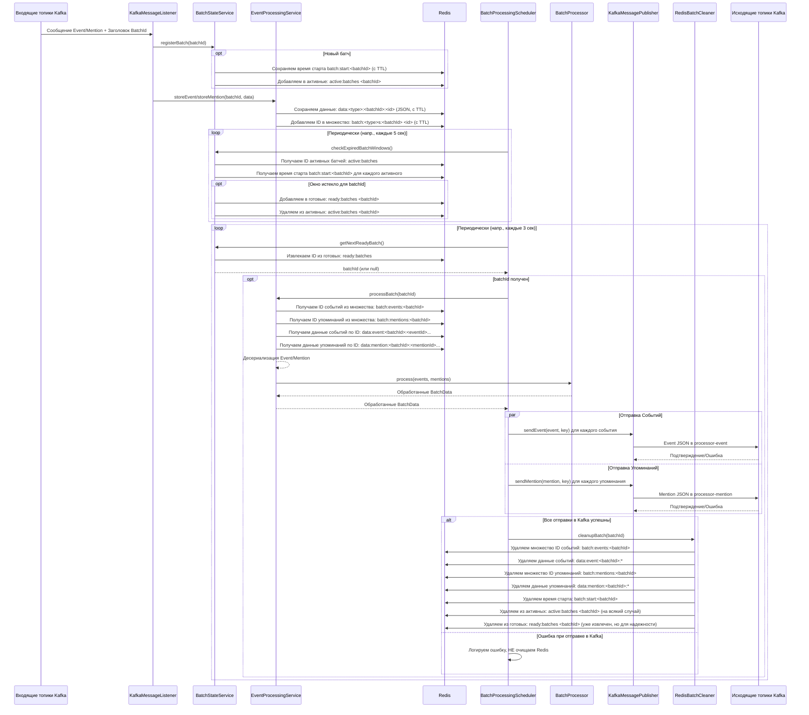

# Сервис обработки событий (em-processor)

Микросервис `em-processor` отвечает за получение объектов событий (`Event`) и упоминаний (`Mention`) из Kafka, временное хранение и группировку их по идентификатору батча (`batchId`) в Redis, выполнение предварительной обработки и последующую отправку обработанных данных в соответствующие топики Kafka для доставки в Elasticsearch.

## Основной рабочий процесс

1.  **Получение данных из Kafka:**
    *   Сервис слушает два топика Kafka (`adapter-event` и `adapter-mention`), содержащие JSON-представления объектов `Event` и `Mention`.
    *   Из заголовка каждого сообщения извлекается идентификатор `batchId`, который группирует пары файлов событий и упоминаний (например, `20250323151500`).

2.  **Регистрация батча и временное хранение в Redis:**
    *   При получении первого сообщения для нового `batchId`, сервис (`BatchStateService`) регистрирует его в Redis и запускает "временное окно" (настраивается, по умолчанию 60 секунд).
    *   Полученные объекты `Event` и `Mention` сериализуются в JSON и сохраняются в Redis (`EventProcessingService`) с ключами, включающими `batchId`. Устанавливается TTL (время жизни) для этих ключей, немного превышающее временное окно, для автоматической очистки в случае сбоев.
    *   Идентификаторы (`GlobalEventId` для событий, `GlobalEventId_MentionIdentifier` для упоминаний) также сохраняются в отдельные множества Redis для каждого `batchId`.

3.  **Контроль временного окна:**
    *   Планировщик (`BatchProcessingScheduler`) периодически проверяет (`BatchStateService.checkExpiredBatchWindows()`) активные батчи в Redis.
    *   Если временное окно для `batchId` истекло, он помечается как "готовый к обработке" (перемещается из множества активных в множество готовых батчей).

4.  **Обработка готовых батчей:**
    *   Планировщик периодически запрашивает (`BatchStateService.getNextReadyBatch()`) готовый `batchId` из Redis.
    *   Если найден готовый батч:
        *   `EventProcessingService.processBatch()` извлекает все связанные с `batchId` события и упоминания из Redis.
        *   Данные передаются в `BatchProcessor`, который выполняет предварительную обработку (на данный момент базовая фильтрация, но предназначен для будущей логики валидации, обогащения, анализа тональности и т.д.).
        *   Возвращается объект `BatchData` с обработанными списками событий и упоминаний.

5.  **Отправка обработанных данных в Kafka:**
    *   `KafkaMessagePublisher` отправляет обработанные объекты в исходящие топики Kafka:
        *   События (`Event`) => `processor-event` (ключ: `GlobalEventId`)
        *   Упоминания (`Mention`) => `processor-mention` (ключ: `GlobalEventId_MentionIdentifier`)
    *   Отправка выполняется асинхронно.

6.  **Очистка состояния в Redis:**
    *   После **успешной** отправки *всех* событий и упоминаний для данного `batchId` в Kafka, вызывается `RedisBatchCleaner.cleanupBatch()`.
    *   Этот компонент полностью удаляет все данные (события, упоминания) и метаданные состояния (время старта, идентификаторы в множествах активных/готовых) для обработанного `batchId` из Redis.

## Обработка ошибок

*   **Ошибки Kafka (Consumer):** Используется стандартный `DefaultErrorHandler` для повторных попыток при временных сбоях.
*   **Ошибки Redis:** Логируются. Проблемы с Redis могут привести к потере данных батча или некорректной обработке окна. TTL на ключах служит механизмом подстраховки для очистки.
*   **Ошибки сериализации/десериализации:** Логируются. Некорректные данные могут быть пропущены.
*   **Ошибки обработки (`BatchProcessor`):** Логируются. В текущей реализации при ошибке обработки возвращаются исходные данные батча.
*   **Ошибки Kafka (Producer):** Логируются. Если отправка хотя бы одного сообщения завершилась ошибкой, очистка Redis для этого `batchId` **не производится**, что позволяет повторно обработать батч при следующем запуске (если данные еще не удалены по TTL).

## Расширяемость

*   **Логика обработки:** Компонент `BatchProcessor` является основной точкой расширения для добавления сложной бизнес-логики обработки данных перед отправкой в Elasticsearch (фильтрация, валидация, анализ тональности, агрегация и т.д.).

## Диаграмма последовательности (клик на кнопку ⟷ развернет схему)

